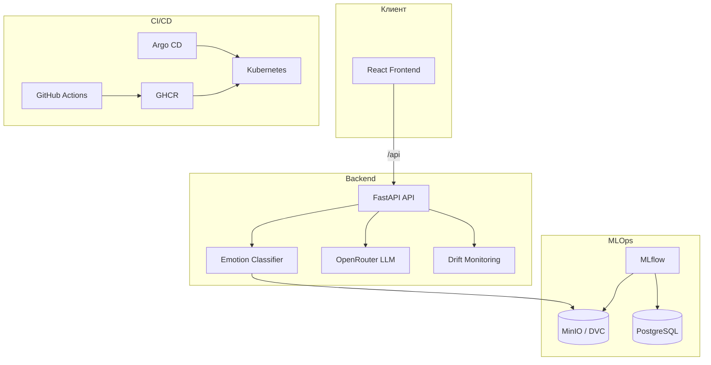

# Lyubava — Emotion-Aware AI Companion

Lyubava — MLOps-проект эмоционально адаптивного AI-компаньона. Система классифицирует эмоции в тексте пользователя, ведёт диалог через LLM (OpenRouter), отслеживает дрифт предсказаний и поставляется через CI/CD в Docker/Kubernetes.

---

## Возможности

- **Классификация эмоций** — Transformer-модель на датасете EmpatheticDialogues (7 классов: joy, sadness, anger, fear, love, guilt, surprise).
- **Чат-компаньон** — ответы на русском с учётом детектированной эмоции (OpenRouter API).
- **MLOps-конвейер** — подготовка данных, обучение, оценка, логирование в MLflow, версионирование артефактов через DVC.
- **Мониторинг** — Prometheus-метрики, дрифт (data / concept / target), админ-панель.
- **Веб-интерфейс** — React-приложение: чат и страница администратора.
- **Деплой** — Docker, docker-compose, Kubernetes (minikube), GitOps через Argo CD.

---

## Стек технологий

| Слой | Технологии |
|------|------------|
| **Backend** | Python 3.12, FastAPI, Uvicorn, PyTorch, HuggingFace Transformers |
| **LLM** | LangChain, OpenRouter |
| **Frontend** | React 19, TypeScript, Vite, Tailwind CSS, TanStack Query |
| **MLOps** | DVC, MLflow, MinIO (S3), PostgreSQL |
| **Мониторинг** | Prometheus, Grafana, prometheus-client |
| **Инфра** | Docker, Kubernetes, Argo CD, GitHub Actions |
| **Качество кода** | pytest, Playwright, black, ruff, pre-commit |
| **Менеджер зависимостей** | uv (Python), npm (frontend) |

---

## Архитектура



---

## Структура репозитория

```text
Lyubava-Emotion-Aware-AI-Companion/
├── src/lyubava/              # Основной Python-пакет
│   ├── api/                  # FastAPI: роуты, сервисы, схемы
│   ├── core/                 # Конфигурация, lifecycle, ошибки
│   ├── data/                 # Подготовка данных, маппинг эмоций
│   ├── models/               # train, evaluate, predict
│   ├── monitoring/           # Метрики Prometheus, дрифт
│   └── utils/                # MLflow-хелперы
├── frontend/                 # React SPA (чат + админка)
├── scripts/                  # CLI-скрипты пайплайна
├── configs/                  # YAML-конфиги (data, model, mlflow)
├── tests/                    # unit + integration тесты
├── k8s/
│   ├── minikube/             # Манифесты для локального k8s
│   ├── overlays/argocd/      # Kustomize overlay (образы из GHCR)
│   └── argocd/               # Argo CD Application / AppProject
├── monitoring/               # Prometheus, Grafana, baselines
├── .github/workflows/        # CI и CD
├── data.dvc / models.dvc     # DVC-трекеры артефактов
├── Dockerfile                # API-образ
├── Dockerfile.mlflow         # MLflow server
└── docker-compose.yml        # MinIO + Postgres + MLflow
```

---

## Требования

- Python **3.12+**
- [uv](https://docs.astral.sh/uv/)
- Node.js **22** и npm **10.9+** (для frontend)
- Docker и Docker Compose (для контейнеров)
- Опционально: minikube, kubectl, Argo CD (для Kubernetes)

---

## Быстрый старт (локальная разработка)

### 1. Клонирование и зависимости

```bash
git clone https://github.com/tarasovEgor/Lyubava-Emotion-Aware-AI-Companion.git
cd Lyubava-Emotion-Aware-AI-Companion

cp .env.example .env
# Отредактируйте пароли и при необходимости OPENROUTER_API_KEY

bash scripts/ci_install_deps.sh --group dev
```

На macOS используйте `ci_install_deps.sh` вместо `uv sync` напрямую — так ставится CPU-версия PyTorch.

### 2. Pre-commit (опционально)

```bash
uv run pre-commit install
```

### 3. Данные и модель (DVC + MinIO)

```bash
docker compose up -d minio

export AWS_ACCESS_KEY_ID=minioadmin
export AWS_SECRET_ACCESS_KEY=<из .env>
export DVC_S3_ENDPOINT_URL=http://localhost:9000

# Создайте bucket "dvc" в MinIO UI (http://localhost:9001), если его нет
bash scripts/dvc_pull_models.sh
```

Если модели в MinIO ещё нет — обучите и загрузите:

```bash
uv run python scripts/prepare_data.py
uv run python scripts/run_emotion_pipeline.py
dvc add models && dvc push models.dvc
```

Для быстрых smoke-тестов без DVC:

```bash
uv run python scripts/create_stub_model.py
```

### 4. Запуск API

```bash
uv run python scripts/run_api.py
# или
uv run uvicorn lyubava.api.main:app --reload --host 0.0.0.0 --port 8000
```

- API: http://localhost:8000  
- Swagger: http://localhost:8000/docs  
- Health: http://localhost:8000/v1/health  

Для чата задайте `OPENROUTER_API_KEY` в `.env`.

### 5. Запуск frontend

```bash
cd frontend
npm ci
npm run dev
```

Приложение: http://localhost:5173 (прокси `/api` → backend).

---

## ML-пайплайн

| Этап | Команда |
|------|---------|
| Подготовка данных | `uv run python scripts/prepare_data.py` |
| Обучение + оценка | `uv run python scripts/run_emotion_pipeline.py` |
| Smoke-тест модели | `uv run python scripts/smoke_predict.py` |
| Только оценка | `uv run python scripts/evaluate_model.py` |

Конфиги: `configs/data.yaml`, `configs/model.yaml`, `configs/mlflow.yaml`.

MLflow + MinIO локально:

```bash
docker compose up -d postgres minio mlflow
```

MLflow UI: http://localhost:5000

Подробнее: [docs/mlflow_storage.md](docs/mlflow_storage.md)

---

## API (основные эндпоинты)

| Метод | Путь | Описание |
|-------|------|----------|
| GET | `/v1/health` | Проверка живости |
| GET | `/v1/ready` | Готовность (модель загружена) |
| POST | `/v1/predict-emotion` | Классификация эмоции по тексту |
| POST | `/v1/chat` | Диалог с учётом эмоции (нужен API-ключ) |
| GET | `/v1/monitoring/drift` | Снимок дрифта |
| GET | `/metrics` | Метрики Prometheus |
| Admin routes | `/v1/admin/*` | Метрики, retrain, prediction feed |

---

## Docker

### API-образ

```bash
uv run python scripts/create_stub_model.py   # или dvc pull
docker build -t lyubava-api:local .
docker run -p 8000:8000 --env-file .env lyubava-api:local
```

### MLflow-стек (compose)

```bash
docker compose up -d
```

| Сервис | URL |
|--------|-----|
| MinIO API | http://localhost:9000 |
| MinIO Console | http://localhost:9001 |
| MLflow | http://localhost:5000 |
| Postgres | localhost:5433 |

---

## Kubernetes и Argo CD

### Minikube (ручной деплой)

```bash
minikube start --cpus 4 --memory 8192

minikube image build -t lyubava-api:latest -f Dockerfile .
minikube image build -t lyubava-mlflow:latest -f Dockerfile.mlflow .
minikube image build -t lyubava-frontend:latest frontend

cp k8s/minikube/.env.example k8s/minikube/.env
# Заполните секреты

kubectl apply -k k8s/minikube
```

Подробнее: [docs/minikube.md](docs/minikube.md)

### Argo CD (GitOps)

```bash
./scripts/argocd_bootstrap.sh
# Создайте ghcr-credentials secret, синхронизируйте app "lyubava"
```

Образы подтягиваются из GHCR (`k8s/overlays/argocd`). Подробнее: [docs/argocd.md](docs/argocd.md)

---

## CI/CD

### CI (каждый push и PR)

| Job | Проверки |
|-----|----------|
| `lint` | black, ruff |
| `test` | pytest (backend) |
| `frontend` | eslint, build, Playwright |
| `docker` | сборка API-образа со stub-моделью + health check |

### CD (push в `develop` / `main`)

1. Попытка `dvc pull` из MinIO (secrets: `DVC_S3_ENDPOINT_URL`, `AWS_ACCESS_KEY_ID`, `AWS_SECRET_ACCESS_KEY`)
2. При недоступности MinIO — fallback на stub-модель
3. Сборка и push в **GHCR**:
   - `api-latest`, `frontend-latest`, `mlflow-latest`

Образы: `ghcr.io/tarasovegor/lyubava-emotion-aware-ai-companion:<tag>`

---

## Тестирование

```bash
# Backend
bash scripts/ci_install_deps.sh --group dev
uv run --group dev --no-sync pytest

# Frontend
cd frontend && npm ci && npm test

# Линтеры
uv run --group dev --no-sync black --check src tests scripts
uv run --group dev --no-sync ruff check src tests scripts
```

---

## Мониторинг

- `GET /metrics` — Prometheus scrape
- `GET /v1/monitoring/drift` — JSON-снимок дрифта
- Baseline: `monitoring/baselines/drift-baseline.json`
- Grafana dashboard: `monitoring/grafana/dashboards/lyubava-drift.json`

В minikube поднимаются Prometheus и Grafana вместе с API (см. `k8s/minikube/monitoring.yaml`).

---

## Документация

| Файл | Содержание |
|------|------------|
| [docs/minikube.md](docs/minikube.md) | Деплой в minikube |
| [docs/argocd.md](docs/argocd.md) | Argo CD + GHCR |
| [docs/mlflow_storage.md](docs/mlflow_storage.md) | MLflow + MinIO |

---

## Переменные окружения

См. [.env.example](.env.example) и [k8s/minikube/.env.example](k8s/minikube/.env.example).

Ключевые:

| Переменная | Назначение |
|------------|------------|
| `OPENROUTER_API_KEY` | LLM для `/v1/chat` |
| `AWS_ACCESS_KEY_ID` / `AWS_SECRET_ACCESS_KEY` | MinIO (MLflow + DVC) |
| `DVC_S3_ENDPOINT_URL` | Endpoint MinIO для DVC |
| `MLFLOW_S3_ENDPOINT_URL` | Endpoint MinIO для MLflow |
| `MODEL_DIR` | Путь к модели (по умолчанию `models/emotion_classifier`) |

---

## Лицензия и авторы

Учебный проект MLOps (ITMO).
